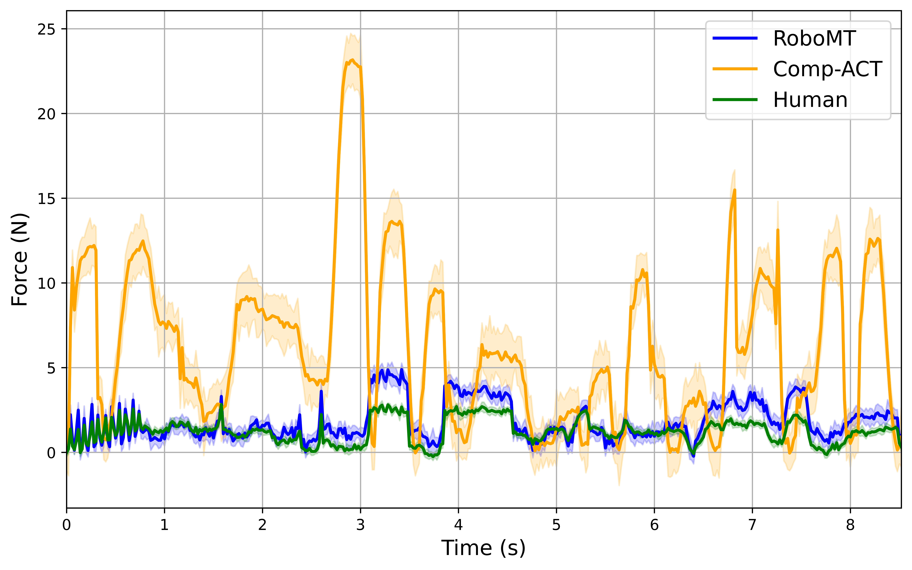
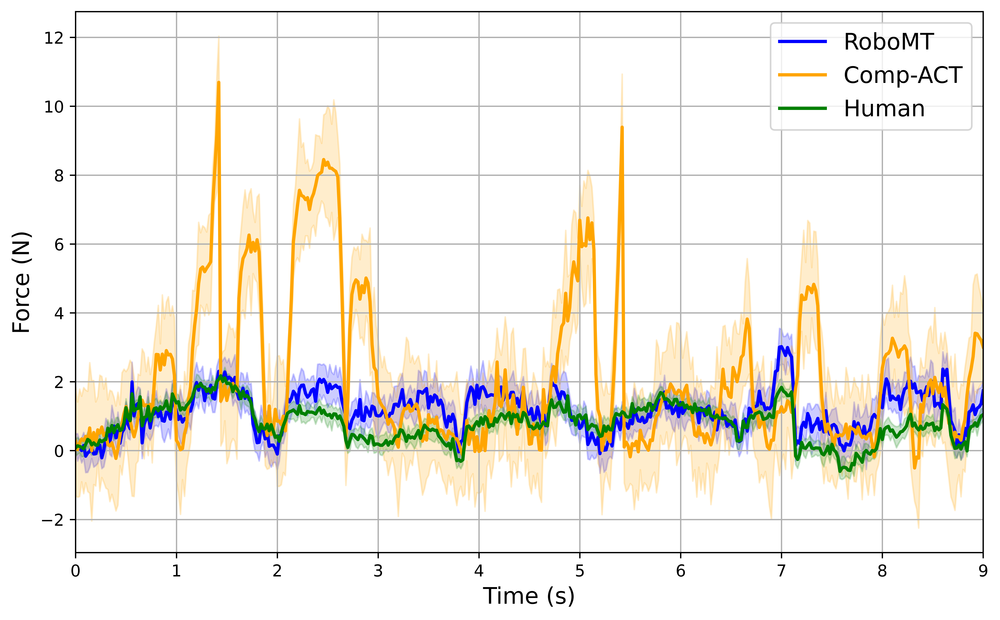
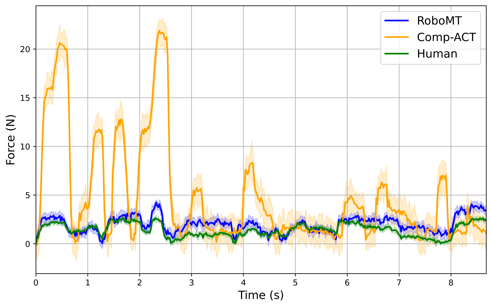
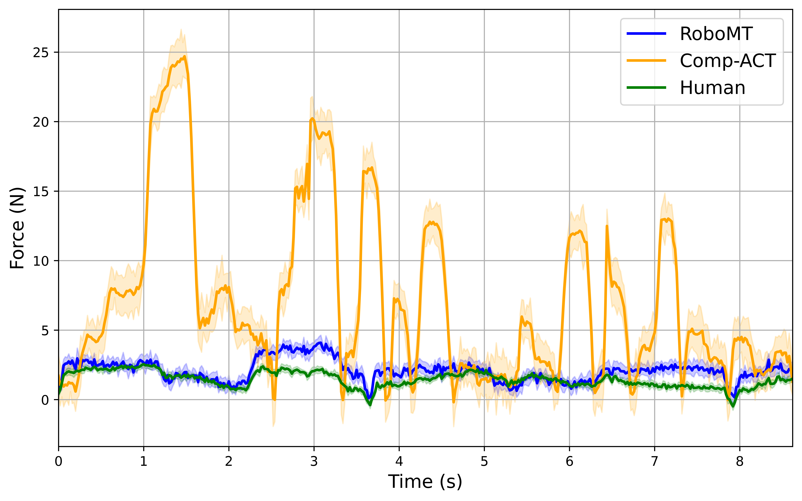

# RoboMT: Human-like Compliance Control via Hybrid Mamba-Transformer Framework

This repository contains the implementation, datasets, and configuration files for the paper:

> **RoboMT: Human-like Compliance Control for Assembly via a Bilateral Robotic Teleoperation and Hybrid Mamba-Transformer Framework**  
> Accepted to IEEE Robotics and Automation Letters (RAL), June 2025

---
## Repository Structure
> ⚠️ This repository is actively maintained and updated. More features, logs, and documentation will be added progressively.

```bash
├── configs/                 # The hyperparameter YAML files for training/testing
├── scripts/                 # Training and evaluation scripts
├── data/                    # Trajectory datasets (force/torque/motion)
├── analysis/                # Force profile plots, ablation stats, success rate logs
└── README.md                # This file
```

---

## Hyperparameter Configuration

This section explains how the core hyperparameters of RoboMT were selected based on empirical evidence, task-specific requirements, and prior literature. Our goal is to balance **control smoothness**, **generalization**, and **responsiveness**.

---
### ε (Threshold) Selection Guidelines for AAC Module
---
The threshold parameter ε determines how the model distinguishes between stable and dynamic interaction states, based on the combined magnitude of contact **force** and **torque** inputs.

| Parameter | Symbol     | Description                                                  |
|-----------|------------|--------------------------------------------------------------|
| Threshold | ε (epsilon) | Distinguishes between stable vs. dynamic force/torque inputs |

#### Selection Strategy

- The optimal values were selected based on the performance across:
  - Task success rate
  - Force stability
  - Smoothness of trajectories

- We performed **grid search** across a range of candidate values for each task, the following guidelines are proposed:

| ε Range (N + Nm) | Environment Type               | Recommended Use Case                             |
|------------------|--------------------------------|--------------------------------------------------|
| ε ≤ 12.0          | Very sensitive                 | Precision tasks, light insertion, fine alignment |
| 12.0 < ε ≤ 12.5    | Sensitive but stable           | Delicate connector alignment        |
| 12.5 < ε ≤ 13.0    | Moderately reactive            | General electronic components        |
| 13.0 < ε ≤ 14.0    | Noise-tolerant, low reactivity | Large surface contact, force variance suppression|
| ε ≥ 14.0          | Very low sensitivity           | Highly noisy conditions (not typically advised)  |


#### Task-Specific Threshold Settings

| Task    | ε (epsilon)| Notes |
|---------|------------|-------|
| RJ45    | 12.8         | Polygonal connector, requires mid-range force responsiveness |
| USB-A   | 12.5         | Rectangular shape with moderate tolerance |
| HDMI    | 13.0         | Trapezoidal, larger contact area requires faster adaptation |
| Type-C  | 12.3         | Oval shape, requires precise alignment with minimal force |

#### Experimental Justification

- **Lower ε **: Provides more sensitive adaptation to contact variations, suitable for tight-tolerance tasks.
- **Higher ε **: Reduces reaction to minor noise, beneficial for high-contact-surface plugs.

These values are defined in `configs/robomt_default.yaml` for runtime selection.

---
### Temporal Fusion: Gaussian Weighting Parameter (σ)

The Temporal Fusion module smooths action predictions using **Gaussian weighting** to ensure stable transitions between overlapping action chunks. This section explains the selection and interpretation of the key hyperparameter σ (sigma), which controls the temporal smoothing strength.

---
#### Gaussian Weighting Parameter Table

| Parameter | Symbol | Recommended Value | Tested Range | Physical Meaning |
|--------|--------|-------------------|--------------|------------------|
| Bandwidth| σ      | 1.2               | [0.5, 2.5]    | Controls temporal smoothing strength:<br>- Small σ → Sharp weighting (recent-focused)<br>- Large σ → Broad weighting (history-blended) |

#### Key Evaluation Metrics

| Metric         | Description                                                  | Goal           |
|----------------|--------------------------------------------------------------|----------------|
| **Curvature**  | Measures trajectory smoothness                               | Lower is better |
| **Force SD**   | Standard deviation of contact force magnitude                | Lower is better |
| **Success Rate** | Completion percentage of task attempts                    | Higher is better |


#### Selection Criteria

The optimal value of σ balances:

- **Responsiveness**:  
  Low σ → quick reaction to force changes (but may overreact to noise)

- **Stability**:  
  High σ → smoother transitions, but slower adaptation

- **Task Requirements**:  
  Some tasks favor precision, others benefit from blended context


#### Task-Specific Tuning

| Task     | Recommended σ | Rationale                                                |
|----------|----------------|----------------------------------------------------------|
| Type-C   | 0.9            | Tighter focus for micro-adjustments in high-precision insertion |
| HDMI     | 1.5            | Broader blending for trapezoidal socket alignment        |
| USB-A    | 1.2            | Balanced approach for rectangular connectors             |
| RJ45     | 1.1            | Slightly sharper focus for polygonal geometry            |
| General  | 1.2            | Default for unknown or mixed-task scenarios              |


#### Performance Validation (Averaged Across Tasks)

| σ Value | Curvature Score ↓ | Force SD (N) ↓ | Success Rate ↑ | Composite Score ↑ |
|---------|--------------------|----------------|----------------|--------------------|
| 0.5     | 15.2 ± 2.1         | 1.10 ± 0.15     | 89.2% ± 3.1%    | 0.72               |
| 0.8     | 10.3 ± 1.5         | 0.95 ± 0.12     | 92.5% ± 2.7%    | 0.81               |
| 1.0     | 8.7 ± 1.2          | 0.90 ± 0.10     | 94.1% ± 2.3%    | 0.87               |
| **1.2** | **6.3 ± 0.9**      | **0.82 ± 0.08** | **97.8% ± 1.5%**| **0.92**           |
| 1.5     | 7.1 ± 1.0          | 0.85 ± 0.09     | 96.3% ± 1.8%    | 0.89               |
| 2.0     | 9.5 ± 1.3          | 0.98 ± 0.11     | 92.0% ± 2.5%    | 0.83               |
| 2.5     | 12.8 ± 1.8         | 1.05 ± 0.14     | 90.1% ± 3.0%    | 0.76               |

**Note**:
- Each result is averaged over 20 trials per σ setting.
- Composite Score = 0.4 × (1/curvature) + 0.3 × (1/force_std) + 0.3 × success_rate
- **Bold row** marks the best overall performer (σ = 1.2)

We recommend using `σ = 1.2` as the **default setting**, with task-specific tuning for further optimization as needed.

---
### Other key settings

| Name            | Value     | Description                                   |
|-----------------|-----------|-----------------------------------------------|
| batch_size      | 8         | Training batch size                           |
| lr              | 1e-5      | Learning rate                                 |
| embed_dim       | 512       | Hidden dimension for encoder/decoder layers   |
| dim_feedforward | 3200      | Feed-forward network dimension in transformer |
| chunk_size      | 100       | Initial action chunk size (AAC max len)       |
| sigma (TF)      | 2.0       | Gaussian spread for Temporal Fusion           |
| loss_weights    | MSE + smooth L1 | Composite trajectory prediction loss     |
| num_epochs      | 700       | Number of training epochs                     |
| seed            | 0         | Random seed for reproducibility               |
| kl_weight       | 10        | KL divergence weight (for policy learning)    |

---
## Datasets

Collected using a bilateral teleoperation platform involving Sigma.7 and Franka Emika Panda.

- 4 tasks: RJ45, USB-A, HDMI, Type-C
- Each with ~270 demonstrations
- Force/Torque (6 DoF), Motion (6 DoF) at 50Hz
- See `data/` for `.hdf5` format logs

---

## Evaluation Results

Metrics:
- Force profile plots
- ablation stats
- success rate logs

### Force Profile Comparisons

| Task     | Force Modulation Plot |
|----------|------------------------|
| HDMI     |       |
| RJ45     |       |
| Type-C   |   |
| USB-A    |     |

Each plot shows:
- Comparisons between **RoboMT**, **Comp-ACT**, and **Human** baselines

All visualizations are located in the `analysis/` directory.

---

## Contact

For any questions, please contact us at:

```text
Rundong Wang — rundong@u.nus.edu
```
